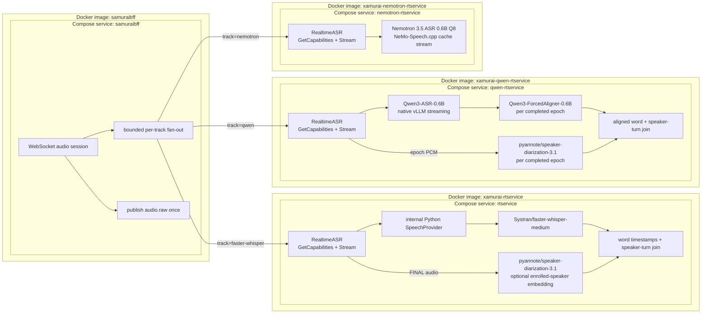

# Xamurai

Xamurai (voX samurai) provides the speech-to-text and speaker-diarization services used by
the nanosamurai platform. It supports realtime transcription over gRPC and
asynchronous refinement, recording, and finalization over Kafka.

For a complete self-hosted Community Edition stack, use the public
[`nanosamurai/nanosamurai`](https://github.com/nanosamurai/nanosamurai)
repository. Deployment orchestration and environment-specific infrastructure
do not live in this service repository.

## Services

- `rtservice` exposes the bidirectional `RealtimeASR` gRPC API and emits
  Faster-Whisper replaceable partials and pyannote-diarized committed finals,
  with optional enrolled-speaker mapping.
- `qwen_rtservice` exposes the same `RealtimeASR` API using Qwen3-ASR's native
  vLLM streaming implementation, then forced-aligns and pyannote-diarizes each
  bounded final epoch when the detected language is supported.
- `qwen_worker` provides batched vLLM finalization and refinement with pyannote
  speaker turns and forced-aligned words, sharing model loading and alignment
  validation with realtime. See [Qwen workers](docs/qwen-workers.md).
- `nemotron_rtservice` exposes the same API using Nemotron 3.5 ASR's
  cache-aware streaming graph through the stable NeMo-Speech.cpp C ABI, with
  optional native Sortformer diarization and tenant-specific S3 speaker matching.
- `whisperx_worker` contains one WhisperX pipeline and two entrypoints:
  `whisperx_worker.refinement` reads audio windows from `audio.raw` and emits
  `transcripts.refined`; `whisperx_worker.finalizer` reads completed recordings
  and emits `transcripts.final`. Both use pyannote and optional enrolled names.
- `parakeet_worker` contains the Parakeet TDT 0.6B v3 pipeline and
  refinement/finalizer entrypoints, with embedded Sortformer and native word timing.
  It supports up to four anonymous speakers per window or recording. See
  [Parakeet refinement](docs/parakeet-refinement.md) for the semi-batch worker.
- `nemo_speech_native` contains the shared NeMo-Speech.cpp bindings, runtime
  checks, verified model downloads and native Docker base for Nemotron and Parakeet.
- `recorder_worker` stores session audio and emits `recordings.finished`.
- `xamurai_serving.finalization` contains the shared recording download,
  track selection, publication and replay loop. Each finalizer supplies its pipeline.
- `xamurai_serving.refinement` and `refinement_runtime` share window buffering,
  inference publication and replay handling between WhisperX, Parakeet and Qwen.
- `shared` contains the compatibility package `drsynth_common`, including
  Kafka tracing, enrollment, logging, and stream-control helpers. The import
  name is retained to avoid breaking downstream consumers.

Persistence is handled by the separate SamuraiPersistor service. Browser and
API traffic is handled by SamuraiBFF.

## Realtime provider architecture

SamuraiBFF can fan the same accepted audio stream out to one or more configured
`RealtimeASR` peers. Each service owns its model lifecycle and bounded session
state, and returns independent track-labelled events through the same public
contract. A slow or failed peer does not become an extra network hop for the
others.



The focused [modular realtime ASR guide](docs/modular-asr-providers.md) defines
the common contract, fixed provider profiles, timing semantics, failure
fallbacks, and resource bounds.

## Model pipelines

| Service | Stage and interface | ASR and alignment models | Speaker and speech models | Output behavior |
| --- | --- | --- | --- | --- |
| `rtservice` | Realtime gRPC | Fixed `Systran/faster-whisper-medium` profile through Faster-Whisper/CTranslate2 | `pyannote/speaker-diarization-3.1`; optional `pyannote/embedding` enrollment mapping and Silero VAD | Replaceable partials; contextual, timestamp-owned, speaker-labelled finals |
| `qwen_rtservice` | Realtime gRPC | Fixed `Qwen/Qwen3-ASR-0.6B` plus `Qwen/Qwen3-ForcedAligner-0.6B` | Fixed `pyannote/speaker-diarization-3.1` pipeline | Native-streaming partials; aligned and diarized epoch finals for supported alignment languages, with a coarse speakerless fallback |
| `nemotron_rtservice` | Realtime gRPC | Fixed `nvidia/nemotron-3.5-asr-streaming-0.6b` Q8 GGUF through NeMo-Speech.cpp | Optional Sortformer v2 Q8; WeSpeaker ONNX for S3 enrollment | Native partials; optionally timed, speaker-labelled finals; no public word-timestamp claim |
| `whisperx_worker.refinement` | Kafka refinement | WhisperX `medium` by default (`WHISPERX_MODEL` is operator-configurable) plus its language-specific alignment model | `pyannote/speaker-diarization-3.1` by default; optional `pyannote/embedding` enrollment mapping | Speaker-aware refined windows while the session is in progress |
| `whisperx_worker.finalizer` | Kafka completed-recording pipeline | Reuses the WhisperX ASR and language-alignment pipeline | Reuses the pyannote diarization and optional enrollment pipeline | Canonical full-session transcript with word timing where alignment succeeds |
| `parakeet_worker.finalizer` | Kafka completed-recording pipeline | Parakeet TDT 0.6B v3 Q8 through NeMo-Speech.cpp; native word timing | Embedded Sortformer v2 Q8 | Independent final track with up to four anonymous speakers |
| `qwen_worker.refinement` / `qwen_worker.finalizer` | Kafka audio windows / completed recordings | Pinned Qwen3-ASR-0.6B through vLLM plus Qwen forced alignment, batched speaker-turn crops | Shared pinned pyannote pipeline | Speaker-labelled segments and aligned words for final playback highlighting |
| `recorder_worker` | Kafka and object storage | None | None | Model-free session WAV assembly and completion notification |

Realtime clients select configured track IDs, not arbitrary model names,
revisions, URLs, or runtime arguments. Operators add another implementation by
deploying a service that satisfies `RealtimeASR` and registering its internal
endpoint with SamuraiBFF.

## Processing pipeline

1. SamuraiBFF publishes each PCM16 `AudioChunk` once to `audio.raw` and fans it
   out to each configured realtime service.
2. Each realtime service streams track-labelled `AsrEvent` updates back over
   the common gRPC contract.
3. `whisperx_worker.refinement` buffers configurable windows and publishes
   `RefinedEvent` messages to `transcripts.refined`.
4. `recorder_worker` finalizes the session recording and publishes
   `RecordingFinished` to `recordings.finished`.
5. Each selected finalizer transcribes the completed recording and publishes
   `SessionTranscript` to `transcripts.final`.

Kafka messages propagate W3C `traceparent` headers. Services also attach the
session and tenant identifiers needed for correlation and isolation.

## Repository layout

- `proto/` and `proto_gen/`: protobuf contract and generated Python bindings
- `rtservice/`: realtime gRPC service
- `qwen_rtservice/`: isolated Qwen3-ASR/vLLM realtime service
- `qwen_worker/`: batched Qwen pipeline and refinement/finalizer entrypoints
- `nemotron_rtservice/`: isolated Nemotron/NeMo-Speech.cpp realtime service
- `whisperx_worker/`: shared WhisperX pipeline, refinement and finalizer entrypoints
- `recorder_worker/`: session recording worker
- `parakeet_worker/`: Parakeet pipeline and finalizer entrypoint
- `nemo_speech_native/`: shared native bindings and Docker base
- `shared/`: common serving, finalization, Kafka, tracing and enrollment code
- `tests/`: unit and integration tests
- `utilities/`: service-level development and diagnostic helpers
- `docs/`: service behavior, performance, and interface documentation

## Development

The checked-in Conda specifications use Xamurai environment names:

```powershell
conda env create -f environment.yml
conda env create -f rtservice/environment.yml
conda env create -f whisperx_worker/environment.yml
conda env create -f recorder_worker/environment.yml
```

Heavy ML tests require the environment matching the service under test.
`HF_TOKEN` is required for gated pyannote models. Grant it only the minimum
model-read permissions required by the test.

### Generate protobuf bindings

From the repository root:

```bash
python -m grpc_tools.protoc \
  -I proto \
  --python_out=proto_gen \
  --grpc_python_out=proto_gen \
  proto/stream.proto
```

Preserve the package-relative import in `proto_gen/stream_pb2_grpc.py` after
generation (`from . import stream_pb2`). The existing
`proto_gen/generate-proto.sh` does this when run from `proto_gen/`.

Generated bindings must be committed together with any contract change.

## Tests

Install the lightweight CI dependencies and run the unit suite:

```bash
python -m pip install -r requirements.ci.txt
pytest -q -m "not integration" \
  tests/test_diarization_assign_unit.py \
  tests/test_enrollment_cache_unit.py \
  tests/test_rtservice_decode_config_unit.py \
  tests/test_rtservice_final_segmentation_unit.py \
  tests/test_rtservice_session_isolation_unit.py \
  tests/test_speech_provider_integration.py \
  tests/test_qwen_rtservice_integration.py \
  tests/test_nemotron_rtservice_integration.py \
  tests/test_stream_controls_unit.py
```

The integration requirements are split by ML stack:

```bash
python -m pip install -r requirements.integration.fastwhisper.txt
pytest -q -m integration tests/test_realtime_asr_grpc.py

python -m pip install -r requirements.integration.whisperx.txt
pytest -q -m integration tests/test_whisperx_worker_integration.py
```

Kafka and object-storage integration tests use Testcontainers and therefore
require a working Docker daemon. The canonical audio fixture is
`tests/data/test_cs.wav`; its provenance and publication consent are documented
in `tests/data/README.md`.

End-to-end stack smoke tests live with their owning environments:

- public Community Edition smoke tests: `nanosamurai/nanosamurai`
- private deployment smoke tests: the deployment repository

## Build service images

Use Docker Buildx Bake from this repository. It builds the shared bases before
their consumers:

```bash
docker buildx bake --load whisperx-worker finalizer-worker nemotron-rtservice parakeet-finalizer
docker buildx bake --load rtservice recorder-worker qwen-rtservice qwen-finalizer qwen-refinement
```

Images use the `local` tag by default; set `TAG` to select another tag.
WhisperX has `Dockerfile.refinement` and `Dockerfile.finalizer`. Parakeet has
`Dockerfile.finalizer`. The finalizer and Nemotron Dockerfiles use named build
contexts supplied by Bake or the Compose build configuration.
The existing `xamurai-whisperx-worker` and `xamurai-finalizer-worker` image names
remain compatible with deployment image pins. These are separate processes;
sharing code and Docker layers does not share loaded GPU weights.

The GitHub image workflow publishes immutable `sha-<git-sha>` tags to:

- `ghcr.io/nanosamurai/xamurai-rtservice`
- `ghcr.io/nanosamurai/xamurai-whisperx-worker`
- `ghcr.io/nanosamurai/xamurai-recorder-worker`
- `ghcr.io/nanosamurai/xamurai-finalizer-worker`
- `ghcr.io/nanosamurai/xamurai-qwen-rtservice`
- `ghcr.io/nanosamurai/xamurai-qwen-finalizer`
- `ghcr.io/nanosamurai/xamurai-qwen-refinement`
- `ghcr.io/nanosamurai/xamurai-nemotron-rtservice`
- `ghcr.io/nanosamurai/xamurai-parakeet-finalizer`

## Configuration

Shared Kafka settings:

- `KAFKA_BOOTSTRAP`
- `KAFKA_TOPIC_AUDIO` (default `audio.raw`)
- `LOG_LEVEL`
- standard OpenTelemetry exporter variables

Realtime service settings include:

- `RT_GRPC_PORT` (default `50052`)
- `RT_SERVING_MAX_SESSIONS` (default `1`; atomic per-process stream admission)
- `HF_TOKEN`
- `RT_WINDOW_SEC` (committed FINAL interval), `RT_OVERLAP_SEC` (left/right
  decoding context), and `RT_EMIT_EVERY_SEC`
- `RT_PARTIAL_ENABLE`, `RT_PARTIAL_MODE`, and overload guardrails
- `RT_ASR_TEMPERATURES` and `RT_ASR_COMPRESSION_RATIO_THRESHOLD`
- `RT_FINAL_DIAR_MERGE_GAP_SEC` and `RT_FINAL_DIAR_MIN_TRANSCRIBE_SEC`
- `ENROLL_BACKEND` plus local or S3 enrollment settings

Qwen realtime service settings include:

- `QWEN_RTSERVICE_PORT` (default `50052`)
- `HF_TOKEN` (required, least-privilege access to the fixed gated pyannote model)
- `QWEN_STREAM_CHUNK_SECONDS` and `QWEN_STREAM_EPOCH_SECONDS`
- `QWEN_EPOCH_CONTEXT_CHARACTERS`, `QWEN_MAX_NEW_TOKENS`, and
  `QWEN_MAX_MODEL_LEN`
- `QWEN_KV_CACHE_MIB` (an explicit vLLM KV-cache allocation rather than a
  fraction of all available VRAM)

Nemotron realtime service settings include:

Per-session controls are service-owned maps advertised by `GetCapabilities`.
The BFF renders boolean/integer/decimal fields and sends each track's values as
`x-rt-settings` JSON. Whisper exposes its window/overlap/cadence/partials; Nemotron
exposes `endpointing_silence_ms`; Qwen currently exposes none. Unknown keys are
ignored. See [the settings contract](docs/stream-output-selection.md#grpc-metadata-rtservice).

- `NEMOTRON_RTSERVICE_PORT` (default `50052`)
- `NEMOTRON_GPU` (default `0`)
- `NEMOTRON_RNNT_RIGHT_CONTEXT` (default `1`, about 160 ms)
- `NEMOTRON_ENDPOINTING_SILENCE_MS` (default `2000`; integer `1`–`30000`):
  native VAD silence timeout, read at startup; invalid values fail startup.
- `NEMOTRON_DIARIZATION` (default `false`); enable Sortformer finals, optionally
  with `ENROLL_BACKEND=s3_manifest` for enrolled names. See the
  [Sortformer and enrollment guide](docs/nemotron-sortformer.md) for the
  four-speaker limit, S3 scope, thresholds, artifact pins and local validation.
- `RT_SERVING_MAX_SESSIONS` (default `1`; values above one enable native
  cross-session microbatching with the same number of independent cache slots)

Nemotron uses NeMo-Speech.cpp's native Silero VAD endpointing (2000 ms by
default) so each utterance is committed independently. The pinned Silero v6.2.0
GGUF is baked into the image; audio masking is disabled, so all audio still
reaches the streaming recognizer. Set
`NEMOTRON_ENDPOINTING_SILENCE_MS=800` for a shorter pause, or
`NEMOTRON_ENDPOINTING_SILENCE_MS=3000` to allow longer pauses, then recreate the
service containers to change the deployment default. A session can override it
through `x-rt-settings: {"endpointing_silence_ms":800}` without a restart.
Longer timeouts delay committed finals and speaker labels;
streaming partials continue. A 30-second forced endpoint is the
hard backstop for uninterrupted speech; this bounds replaceable partial text
without limiting the total stream duration. The adapter enables the native
automatic-punctuation request gate so Nemotron 3.5's own punctuation and
capitalization are retained; no separate PnC model is loaded.

VAD avoids treating missing decoder tokens as silence; it does not add overlap
or change native endpoint resets. The 30-second backstop can still split words.
See [native VAD validation](docs/nemotron-vad.md) for artifact pins and tests.

Worker settings include:

- `WHISPERX_SLICE_SECONDS`, `WHISPERX_IDLE_SECONDS`, and diarization guardrails
- `RECORDING_STORAGE_BACKEND` (`local` or `s3`)
- `RECORDING_DIR` or the corresponding S3 bucket, region, endpoint, and prefix
- topic and consumer-group overrides for each worker

Per-stream output selection and compute controls are documented in
[`docs/stream-output-selection.md`](docs/stream-output-selection.md).
Provider profiles and the native Qwen path are documented in
[`docs/modular-asr-providers.md`](docs/modular-asr-providers.md).

## Security

- Treat Kafka headers and gRPC metadata as untrusted input.
- Enforce tenant quotas and clamp compute-amplifying stream controls at the
  authenticated API boundary.
- Never commit tokens, recordings, transcripts, enrollment samples, or
  customer data.
- Prefer workload identity over static object-storage credentials.
- Pyannote telemetry is force-disabled to prevent unexpected outbound metric
  export.
- Bind diagnostic endpoints to localhost for local development. Any broader
  exposure is an explicit deployment decision and must have access controls.

Report vulnerabilities privately as described in
[`SECURITY.md`](SECURITY.md).

## Additional documentation

- [`docs/stream-output-selection.md`](docs/stream-output-selection.md)
- [`docs/whisperx-worker-diarization.md`](docs/whisperx-worker-diarization.md)
- [`docs/rtservice-performance.md`](docs/rtservice-performance.md)
- [`docs/modular-asr-providers.md`](docs/modular-asr-providers.md)
- [`docs/enrolled-speakers-multi-tenant.md`](docs/enrolled-speakers-multi-tenant.md)
- [`docs/word-level-timing.md`](docs/word-level-timing.md)
- [`docs/ci-cd.md`](docs/ci-cd.md)

## License

Licensed under Apache License 2.0. See [`LICENSE`](LICENSE) and
[`NOTICE`](NOTICE).

## Final track contract

`SessionTranscript` adds `string track_id = 9`; other protobuf messages and
Kafka session keys are unchanged. Omitted track IDs mean `whisperx`.
Regenerate Python bindings with the existing command after changing the proto.

Each finalizer uses `FINALIZER_TRACK_ID` (default `whisperx`) and its own
`KAFKA_GROUP_ID_FINALIZER` (default `finalizer.<track_id>`). Replicas of one
track share that group. `x-final-tracks` is an ordered CSV selection on
`audio.raw`, forwarded by the recorder to `recordings.finished`. Workers skip
unselected or disabled final stages. The final `model` header contains the
configured `WHISPERX_MODEL` label (default `medium`).

Finalizers publish with acknowledgement before committing their input. A
download, inference or publish/commit failure stops the worker for replay on
restart. A permanently invalid source needs operator repair; it is not silently
committed. Multiple final
tracks require `store_recording=true`; BFF rejects the unsafe combination
before audio, and the worker also rejects it. Single-track retention behavior
is preserved. Transcript JSON sidecars are no longer written; Persistor owns
transcript storage in Postgres. Use the Community Edition Compose final-track
smoke for real WhisperX plus a test-only synthetic second track.

The acknowledgement wait polls Kafka to dispatch delivery callbacks promptly.
Temporary S3 WAV downloads are removed after processing; retained source
recordings stay in their existing storage.

Local Docker builds exclude `.env` files and scratch worktrees from their
contexts. Never copy model credentials into an image.

## Refinement track contract

Refinement tracks add only `RefinedEvent.track_id = 16`; an empty ID means
`whisperx`. Audio, segment and word message shapes and Kafka keys stay unchanged.


Each existing refinement worker has `REFINEMENT_TRACK_ID` (default `whisperx`)
with a default consumer group `refinement.<track>`. `KAFKA_GROUP_ID` overrides
that group; replicas of one track share it, different tracks must not. Existing
Compose deployments can retain their `whisperx-async` group. The worker filters
`x-refinement-tracks` on `audio.raw` and honors `x-outputs`; a missing selection
means only WhisperX, while an explicitly empty selection selects no worker.
Each pipeline supplies `refinement_model`: `WHISPERX_MODEL` for WhisperX and
`nvidia/parakeet-tdt-0.6b-v3` for Parakeet. Parakeet's image defaults its track to
`parakeet`. See [Parakeet refinement](docs/parakeet-refinement.md) for shared
window/idle/queue settings and window-local speaker identity.

Both full windows and idle tails now use the existing decoupled runtime and
publish path. The duplicate synchronous loop and at-most-once switch are
removed. `WHISPERX_DECOUPLE_IO`, `WHISPERX_COMMIT_AFTER_PRODUCE` and scheduler-only
batch flags no longer select a different runtime. `WHISPERX_READY_QUEUE_MAX`
still bounds queued work; Kafka polling stays responsive during inference.
Window bounds are cumulative PCM sample counts, independent of model segment
ends. Segments remain session-relative; no stored windows, new topics or result
messages are introduced. Publication waits for Kafka acknowledgment.

Offsets stay behind the first audio record of every active session on a
partition until all its windows and idle tail have been published. Unselected
messages cannot advance past that work. Revocation invalidates local buffers
and queued completions. Another replica replays retained audio, including any
already published windows, which the deployment's migration 019 deduplicates.
A worker failure affects its own consumer group. This conservative policy can
repeat inference for an active session and holds partition progress behind a
long active session; Kafka audio retention must cover that recovery interval.

The existing idle timeout remains the completion signal. Resuming a session
after it has been idle-flushed/evicted starts a new timing origin, including
after restart. A durable end/resume contract is a follow-up, not added here.
Start a new session after completion. See `docs/refinement-tracks-spike.md` for
qualification and deployment boundaries.
