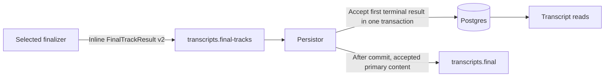

# Final transcripts in Postgres

The opt-in final-track path stores every terminal outcome in
`session_transcripts`: `full_text`, `segments` JSONB, track/profile/plan identity,
status, availability, degradations and the recording association. There is one
row per logical result. Source audio retains its existing S3 role.

Persistor owns primary compatibility publication for this path. The legacy
finalizer still publishes its existing `SessionTranscript` when no track plan
is present. Selection and the tenant-owned frozen plan remain unchanged.
Persistor derives primary selection from that plan. Secondary results and failed
outcomes cannot become the default transcript merely by arriving later.

## Contract and recovery

`FinalTrackResult.schema_version=2` has 18 fields. Removed execution hierarchy,
artifact URI/digest, primary and provenance fields have reserved names/numbers.
Inline `full_text` and `segments` use tags 27/28; tag 26 remains available to the
preserved refinement draft. Retained tags/types and stable result IDs are unchanged.
Silence succeeds with empty content and false availability flags. Missing timing
or speakers remains explicit; failures contain an error code and no transcript.

The worker publishes only the inline result, then acknowledges its recording
input. It never reads/writes transcript objects or outcome manifests. A replay
can repeat inference. The first terminal result accepted by Persistor is
authoritative: retries return that row, even if later inference differs.
Conflicting tenant, plan, profile or source identities cannot overwrite it.

Persistor acknowledges its input only after the transaction commits and any
primary publication is acknowledged. A retry after commit republishes the
accepted content. Its legacy consumer verifies identified compatibility events
against the accepted row instead of creating another transcript. A crash after
publication and before offset commit can duplicate publication. This remains
at-least-once delivery, with no exactly-once inference, webhook or workflow claim
and no outbox service.

An inline protobuf may occupy at most 900,000 bytes. The entire keyed Kafka
record, bounded tracing headers and a conservative framing allowance must fit
1,000,000 bytes. Local brokers/producers/partition fetches allow at least
1,048,576 bytes. Oversized model content becomes a bounded `result_too_large`
failure; oversized input records are rejected before persistence. Transcript
contents and raw provider exceptions are not logged.

## Migration and rollout

Apply Compose migration 016 before either corrected service. It extends the
existing transcript table and adopts already-stored primary metadata. Migrations
014/015 are preserved because they have been applied locally. The old
`transcript_track_results` table is retained only as migration input and for the
held refinement drafts; corrected final-track runtime code neither writes nor
reads it. Do not drop it or reset volumes before all retained data is accounted for.

Keep producers stopped while inventorying old topic offsets and result objects.
Drain old work with the matching old service set, verify/import retained results,
then apply schema and deploy the corrected consumer before the new producer.
Schema-1 reference records stop for explicit conversion and remain uncommitted;
they are not silently discarded or fetched through a runtime S3 fallback.
Do not rewind a corrected consumer onto retained schema-1 history.

For rollback, stop/drain new producers and the corrected consumer, preserve the
schema/data, and restore the complete previous service set with its recorded
offsets. Never run a schema-1 consumer against schema-2 records. Existing branches
and locally retained images remain available; no automatic rollback/down migration
is provided for populated transcript rows.

Session deletion cascades to its transcripts and recordings; a result arriving
after deletion cannot recreate the session. Shared source-audio object retention
and deletion during recording assembly remain separate lifecycle work. Wider
rollout stays gated on the retained-data checks and those existing limitations.
