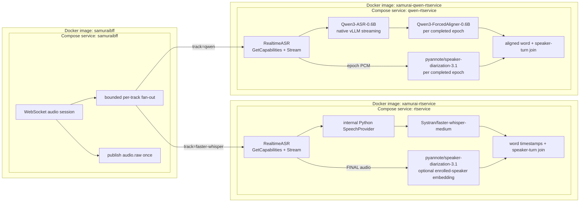

# Modular realtime ASR services

Faster-Whisper and Qwen are peer services behind the same public
`RealtimeASR` gRPC API. SamuraiBFF owns the configured track list and fans one
accepted audio stream out to those peers. There is no
`rtservice -> SpeechProvider gRPC -> Qwen` hop.
The repository [README](../README.md#model-pipelines) summarizes every Xamurai
service's model pipeline; this guide defines the realtime contract and the two
current fixed provider profiles in detail.

## Common service contract

Every realtime service implements:

- `GetCapabilities(RealtimeCapabilitiesRequest) -> RealtimeCapabilities`;
- `Stream(stream AudioChunk) -> stream AsrEvent`.

Capabilities describe mode, timestamp, speaker-label and language support, statefulness,
sample rate, limits, runtime, and immutable model/implementation provenance.
`AsrEvent.provider_profile_id` identifies the implementation profile. The BFF
adds its operator-controlled `track` ID and `primary_track` compatibility flag
to WebSocket events; a client cannot supply a model endpoint or model ID.
Language identifiers at this public boundary use short codes (`cs`, `en`,
`id`, and so on). The Qwen adapter translates these to the language names its
official library accepts and translates detected names back to codes in both
capabilities and events.

Natural request EOF is the flush signal. A service drains accepted chunks,
emits its terminal result when available, and completes its response stream.
Cancellation is immediate teardown and does not synthesize a final result.

## Internal implementation boundaries

The Faster service retains the `SpeechProvider` Python Protocol because it
separates rolling-window/session policy from Faster-Whisper preprocessing and
decoding with little transport overhead. `LocalFasterWhisperProvider` is the
only registered profile in that process. VAD, contextual window ownership,
partial/final state, diarization, and enrolled-speaker mapping remain in
`rtservice`.

The Qwen service is already isolated by its public service/container boundary,
so it does not reimplement the removed remote `SpeechProvider` gRPC layer. Its
small `QwenBackend` Protocol isolates the public stream handling from the
official Qwen library for tests. This avoids daisy-chained gRPC services and
lets either realtime implementation be deployed, restarted, and scaled as a
peer.

## Fixed profiles

| BFF track | Provider profile | Runtime and mode | Timing claims |
| --- | --- | --- | --- |
| `faster-whisper` | `faster-whisper-medium-ctranslate2-r1` | `Systran/faster-whisper-medium`; Faster-Whisper 1.2 / CTranslate2 4.6; `pyannote/speaker-diarization-3.1`; contextual windowed realtime with optional Silero VAD and enrollment mapping | Internal absolute word timestamps with deterministic seam ownership; public coalesced speaker segments |
| `qwen` | `qwen3-asr-0.6b-vllm-aligned-diarized-r3` | `Qwen/Qwen3-ASR-0.6B`; `Qwen/Qwen3-ForcedAligner-0.6B`; `pyannote/speaker-diarization-3.1`; `qwen-asr==0.0.6`; `vllm==0.14.0`; bounded native-streaming epochs; one concurrent session | Aligned, speaker-labelled final segments for the aligner's advertised languages; coarse speakerless fallback otherwise; no word-timestamp claim |

The Qwen profile pins `Qwen/Qwen3-ASR-0.6B` revision
`c4468bdb552ddc559e464f6081e22dd4034f2e68` and verifies the
`model.safetensors` digest
`sha256:79d6cbd4c98c7bbffe9db2edac07f56cd6637d0d5944b27f6c2b8353840323ea`
before initializing inference. No RPC accepts an arbitrary model ID, revision,
URL, or runtime argument.

The same profile pins `Qwen/Qwen3-ForcedAligner-0.6B` revision
`c7cbfc2048c462b0d63a45797104fc9db3ad62b7` and verifies its
`model.safetensors` digest
`sha256:47831d0e82f96b20e9034dba01a075ee06436654719f6a68289e49f1b65ce0e7`.
It also fixes the gated `pyannote/speaker-diarization-3.1` pipeline at revision
`84fd25912480287da0247647c3d2b4853cb3ee5d` and verifies its configuration
digest. The pipeline's referenced weights are resolved separately at fixed
revisions and verified before initialization:

- `pyannote/segmentation-3.0` revision
  `e66f3d3b9eb0873085418a7b813d3b369bf160bb`, SHA-256
  `da85c29829d4002daedd676e012936488234d9255e65e86dfab9bec6b1729298`;
- `pyannote/wespeaker-voxceleb-resnet34-LM` revision
  `837717ddb9ff5507820346191109dc79c958d614`, SHA-256
  `366edf44f4c80889a3eb7a9d7bdf02c4aede3127f7dd15e274dcdb826b143c56`.

The service requires a least-privilege `HF_TOKEN` with access to those gated
artifacts; it never logs the token, transcript text, or audio.

## Faster contextual FINAL ownership

For Faster-Whisper, `RT_WINDOW_SEC` is a committed interval and
`RT_OVERLAP_SEC` is decoding context on both sides. With `10` and `1`, the
steady-state commits are `[0,10)`, `[10,20)`, and so on, while their analysis
windows are `[0,11]`, `[9,21]`, and so on. A FINAL waits for its right context;
EOF finalizes the pending interval without it.

The provider returns its word timestamps on the session's absolute integer-
sample timeline. A word is emitted only by the half-open commit interval
containing its midpoint. The engine then assigns those owned words to pyannote
turns with the shared overlap model, uses the nearest turn for a boundary gap,
maps sufficiently long raw-speaker audio against tenant enrollment, and
coalesces adjacent words with the same resulting speaker. Context can therefore
repair a word at a seam without duplicating it in the next FINAL.

Per-session hot state remains keyed by `(tenant_id, session_id)` and protected
by its existing lock. Audio is held as compact PCM16; after a commit the engine
retains only one left-context margin plus uncommitted/right-context audio. At
16 kHz, a 10-second commit with one second on each side is about 384 KiB of
steady-state audio per active session, plus the current incoming chunk. The old
session-lifetime timestamp dedupe set is no longer needed. Idle eviction and
explicit stream teardown continue to release the whole state.

## Qwen/vLLM lifecycle

The Qwen container starts only `python -m qwen_rtservice.server`. That process
constructs `Qwen3ASRModel.LLM(...)`; the `qwen-asr` adapter initializes and
owns vLLM in-process. There is no separate `vllm serve` command or sidecar.

Each RPC remains one continuous public gRPC stream, but the service bounds the
official Qwen state and PCM buffer to an epoch (60 seconds by default). At an
epoch boundary it calls `finish_streaming_transcribe`, extracts only text not
already committed as context, aligns that text against the bounded epoch PCM,
runs pyannote diarization over the same PCM, assigns aligned words by temporal
overlap, uses the nearest diarization turn for words landing in a speech/silence
boundary gap, coalesces adjacent words with the same speaker, and emits
absolute-time `FINAL` segments. It then opens a fresh
`init_streaming_state` with a bounded tail of transcript context. The next
`PARTIAL` starts at the same sample boundary, so no audio is replayed and the
public track has neither a gap nor duplicated seam text. Request EOF flushes
and enriches the current epoch by the same path and closes the public stream
normally.

The forced aligner normalizes punctuation (for example, `real-time` may become
`realtime`). The join therefore matches Unicode alphanumeric content while
mapping every unit back to a slice of the committed Qwen transcript. Emitted
text preserves Qwen's original punctuation and spacing; a normalization that
cannot be mapped safely takes the coarse fallback.

The aligner can also return a transcript unit whose start and end timestamps
are equal. Such units cannot participate in temporal speaker assignment, so
the adapter ignores their empty time range while retaining their committed
text in the neighboring positive-duration transcript slice. If no usable
aligned range remains, the epoch takes the normal coarse speakerless fallback.

Only a fully successful alignment-and-diarization result emits speaker-labelled
segments. An unsupported alignment language, alignment failure, missing
pyannote turns, or other enrichment failure emits the original coarse
speakerless final instead of dropping committed text. Anonymous speaker labels
are deliberately epoch-scoped (`EPOCH_0001/SPEAKER_00`, and so on); cross-epoch
identity and enrolled-speaker mapping remain future work and are not implied by
the capability response.

The upstream adapter buffers the configured chunk, re-feeds audio accumulated
within the current epoch, and applies token-prefix rollback. “Native streaming”
describes this official API; it does not imply constant work per chunk or an
acoustic KV cache. Restarted epochs were chosen for the initial implementation
because the official API has no supported state-truncation operation. Rolling
audio overlap can be evaluated later if real seam-quality measurements justify
the duplicate-suppression complexity.

| Variable | Default | Allowed range |
| --- | ---: | ---: |
| `QWEN_STREAM_CHUNK_SECONDS` | `2.0` | `0.5`-`10.0` |
| `QWEN_STREAM_EPOCH_SECONDS` | `60.0` | `10.0`-`300.0` |
| `QWEN_EPOCH_CONTEXT_CHARACTERS` | `1000` | `500`-`8000` |
| `QWEN_MAX_NEW_TOKENS` | `1024` | `16`-`1024` |
| `QWEN_MAX_MODEL_LEN` | `4096` | `2048`-`65536` |
| `QWEN_KV_CACHE_MIB` | `512` | `512`-`16384` |

`QWEN_MAX_MODEL_LEN` must cover the configured epoch's estimated audio tokens,
the bounded context tail, output tokens, and safety margin. `QWEN_KV_CACHE_MIB`
must cover that context using the pinned model's KV geometry. The service
rejects incompatible settings at startup. This replaces vLLM's percentage-of-
GPU allocation, which reserved roughly 10 GiB for the earlier 0.65 setting on
the 24 GiB development GPU despite the 0.6B model size.

The profile advertises `maximum_audio_seconds=0`, meaning the public stream has
no provider-imposed duration cutoff. It still advertises the real one-session
concurrency limit. `speaker_labels` and `segment_timestamps` are true when the
enricher is active, `word_timestamps` remains false, and
`aligned_diarized_languages` contains only the public language codes reported
by the pinned aligner. Epoch duration is an internal compute bound, not a
recording limit.

The service requires CUDA, runs as UID 10002, disables Hugging Face/vLLM
telemetry, and does not log audio or transcript contents. In the Compose
evaluation stack its gRPC port remains network-internal.

## Failure isolation and BFF orchestration

`SAMURAIBFF_GRPC_REALTIME_TRACKS` is an operator-controlled, maximum-four
allowlist in the form `track-id=host:port,...`. Each track has its own bounded
queue, gRPC stream, capability handshake, cancellation, and completion state.
A full or failed track is canceled without closing its healthy peers or the
browser session. The first configured track is the compatibility primary.

The BFF publishes every accepted chunk to `audio.raw` once, independently of
the number of realtime tracks. The existing Kafka refinement, recording, and
finalization path therefore remains unchanged and is not duplicated per model.

## Validation

The lightweight Xamurai suite covers both real localhost gRPC service
boundaries with fake model backends, including capabilities, native
partial/final delivery, contiguous sequencing, cancellation permit recovery,
safe inference/enrichment failure with coarse fallback, overlap-based speaker
assignment with nearest-turn handling at silence boundaries,
subsequent-session recovery, and a synthetic stream
longer than 300 seconds that crosses more than 30 bounded epochs without
duplicate or discontinuous public segments. BFF integration tests
send one WebSocket audio stream to two fake `RealtimeASR` peers and prove that
all accepted chunks, EOF, and track-labelled terminal events reach both.

The earlier single-Qwen Compose prototype validated the pinned runtime on an
RTX 5090 Laptop GPU before the peer-service refactor. Cold readiness was 340.7
seconds and preserved-cache readiness 33.6 seconds; two consecutive 12-second
fixture sessions each emitted six partials and one final. Those measurements
remain model/runtime evidence, while the peer dual-track topology requires its
own final Compose result before Phase 2a is closed.
