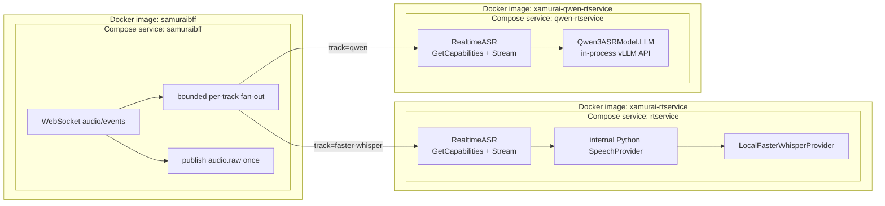

# Modular realtime ASR services

Faster-Whisper and Qwen are peer services behind the same public
`RealtimeASR` gRPC API. SamuraiBFF owns the configured track list and fans one
accepted audio stream out to those peers. There is no
`rtservice -> SpeechProvider gRPC -> Qwen` hop.

## Common service contract

Every realtime service implements:

- `GetCapabilities(RealtimeCapabilitiesRequest) -> RealtimeCapabilities`;
- `Stream(stream AudioChunk) -> stream AsrEvent`.

Capabilities describe mode, timestamp and language support, statefulness,
sample rate, limits, runtime, and immutable model/implementation provenance.
`AsrEvent.provider_profile_id` identifies the implementation profile. The BFF
adds its operator-controlled `track` ID and `primary_track` compatibility flag
to WebSocket events; a client cannot supply a model endpoint or model ID.
Language identifiers at this public boundary use short codes (`cs`, `en`,
`id`, and so on). The Qwen adapter translates these to the language names its
official library accepts and translates detected names back to codes in both
capabilities and events.

Natural request EOF is the flush signal. A service drains accepted chunks,
emits its terminal result when available, and completes its response stream.
Cancellation is immediate teardown and does not synthesize a final result.

## Internal implementation boundaries

The Faster service retains the `SpeechProvider` Python Protocol because it
separates rolling-window/session policy from Faster-Whisper preprocessing and
decoding with little transport overhead. `LocalFasterWhisperProvider` is the
only registered profile in that process. VAD, window overlap, partial/final
state, diarization, and enrolled-speaker mapping remain in `rtservice`.

The Qwen service is already isolated by its public service/container boundary,
so it does not reimplement the removed remote `SpeechProvider` gRPC layer. Its
small `QwenBackend` Protocol isolates the public stream handling from the
official Qwen library for tests. This avoids daisy-chained gRPC services and
lets either realtime implementation be deployed, restarted, and scaled as a
peer.

## Fixed profiles

| BFF track | Provider profile | Runtime and mode | Timing claims |
| --- | --- | --- | --- |
| `faster-whisper` | `faster-whisper-medium-ctranslate2-r1` | Faster-Whisper 1.2 / CTranslate2 4.6; windowed realtime with VAD, diarization, enrollment mapping, partials, and finals | Existing window/segment behavior and word timestamps |
| `qwen` | `qwen3-asr-0.6b-vllm-r1` | `qwen-asr==0.0.6`; `vllm==0.14.0`; native stateful stream; one concurrent session in this validation profile | Cumulative sample range only; no word or segment timestamps |

The Qwen profile pins `Qwen/Qwen3-ASR-0.6B` revision
`c4468bdb552ddc559e464f6081e22dd4034f2e68` and verifies the
`model.safetensors` digest
`sha256:79d6cbd4c98c7bbffe9db2edac07f56cd6637d0d5944b27f6c2b8353840323ea`
before initializing inference. No RPC accepts an arbitrary model ID, revision,
URL, or runtime argument.

## Qwen/vLLM lifecycle

The Qwen container starts only `python -m qwen_rtservice.server`. That process
constructs `Qwen3ASRModel.LLM(...)`; the `qwen-asr` adapter initializes and
owns vLLM in-process. There is no separate `vllm serve` command or sidecar.

Each RPC creates one official Qwen streaming state with
`init_streaming_state`, feeds PCM16 samples through `streaming_transcribe`, and
calls `finish_streaming_transcribe` at request EOF. The upstream adapter
buffers the configured chunk, re-feeds accumulated audio, and applies
token-prefix rollback. “Native streaming” describes this official API; it does
not imply constant work per chunk or an acoustic KV cache.

| Variable | Default | Allowed range |
| --- | ---: | ---: |
| `QWEN_GPU_MEMORY_UTILIZATION` | `0.65` | `0.1`-`0.95` |
| `QWEN_STREAM_CHUNK_SECONDS` | `2.0` | `0.5`-`10.0` |
| `QWEN_MAX_NEW_TOKENS` | `256` | `16`-`1024` |
| `QWEN_MAX_AUDIO_SECONDS` | `300` | `1`-`1800` |

The service requires CUDA, runs as UID 10002, disables Hugging Face/vLLM
telemetry, and does not log audio or transcript contents. In the Compose
evaluation stack its gRPC port remains network-internal.

## Failure isolation and BFF orchestration

`SAMURAIBFF_GRPC_REALTIME_TRACKS` is an operator-controlled, maximum-four
allowlist in the form `track-id=host:port,...`. Each track has its own bounded
queue, gRPC stream, capability handshake, cancellation, and completion state.
A full or failed track is canceled without closing its healthy peers or the
browser session. The first configured track is the compatibility primary.

The BFF publishes every accepted chunk to `audio.raw` once, independently of
the number of realtime tracks. The existing Kafka refinement, recording, and
finalization path therefore remains unchanged and is not duplicated per model.

## Validation

The lightweight Xamurai suite covers both real localhost gRPC service
boundaries with fake model backends, including capabilities, native
partial/final delivery, contiguous sequencing, cancellation permit recovery,
safe inference failure, and subsequent-session recovery. BFF integration tests
send one WebSocket audio stream to two fake `RealtimeASR` peers and prove that
all accepted chunks, EOF, and track-labelled terminal events reach both.

The earlier single-Qwen Compose prototype validated the pinned runtime on an
RTX 5090 Laptop GPU before the peer-service refactor. Cold readiness was 340.7
seconds and preserved-cache readiness 33.6 seconds; two consecutive 12-second
fixture sessions each emitted six partials and one final. Those measurements
remain model/runtime evidence, while the peer dual-track topology requires its
own final Compose result before Phase 2a is closed.
